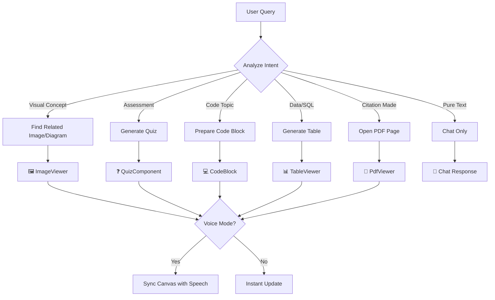

# Portfolio Personalization Questionnaire

> Fill this out honestly. One sentence is fine for most answers.
> The goal: replace every generic/placeholder detail in the portfolio with things that are actually true about you.

---

## 1. IDENTITY & HOMEPAGE

**1.1** The homepage currently says _"3rd-year CSE (AI/ML) student from India (West Bengal). Goal: Full financial independence in 2.5 years."_
Is the financial independence goal still the core story you want front and center, or has your positioning changed? What's the one-line that best describes you right now?

```
Your answer: this is the core goal but i thinkk in hero we sshould be professioanl and lind of shows m yprifsisonal tech side only
```

**1.2** What year do you graduate? (Used to update "3rd-year" to something time-accurate)

```
Your answer:2027 .also i odnot think we sould show in lanfign page, move somewehre elese , if possble jsut ommit 3rd year from website
```

**1.3** Do you have a profile photo you want on the site? If yes, what's the filename/path?

```
Your answer:C:\Users\Suman Jana\Desktop\enji-dev\apps\enji.dev\public\mypic.jpg
```

**1.4** Twitter/X handle? (Currently missing from social links, your GitHub is `rocker1166`)

```
Your answer: added , you can chek
```

---

## 2. NEW PROJECTS (not on the portfolio yet)

> For each project you mention, answer A–E. Skip what doesn't apply.

**2.1** What are the new projects you're working on or have shipped recently?
List them with a one-line description:

````
Project 1:  # ClassPilot: AI-Powered RAG Tutor

ClassPilot is a production-grade, scalable, and highly intelligent AI-Powered Retrieval-Augmented Generation (RAG) Tutor designed for college courses. It provides students with 24/7, course-specific academic support that guides them toward answers via Socratic questioning, while giving faculty deep insights into student learning patterns.

## 🌟 Key Features

### For Students
- **Course-Aware RAG Tutor:** AI guidance restricted exclusively to provided lecture notes and textbooks.
- **Socratic Tutoring:** Guides students with questions rather than direct answers (configurable strictness).
- **Interactive Chat & Voice:** Left-panel chat supporting text and duplex voice communication (via LiveKit/Vapi).
- **Dynamic Interactive Canvas (AGUI):** Right-panel canvas for Quizzes, PDF Viewers, Vision Overlays, and Code Blocks.
- **Real-time Source Citation:** Instant scrolling to the exact page of cited PDF materials.
- **Optional External Search:** Integrated Google Search for broader context when enabled.

### For Faculty
- **Resource Management:** Easy upload and organization of PDFs, TXT, images, and other materials.
- **Confusion Heatmap:** Visualizations of frequently asked-about topics across all students.
- **Student Analytics:** Granular progress metrics, quiz performance, and engagement tracking.
- **Query Reporting:** Topic-wise and student-wise reports to optimize teaching.

## 🛠️ Tech Stack

- **Frontend:** Next.js (App Router), TypeScript, Tailwind CSS, Shadcn UI, Framer Motion.
- **Backend & Database:** [Convex](https://www.convex.dev/) (Real-time DB, Serverless Functions, Vector Search).
- **AI Orchestration:** LangGraph.js.
- **LLMs:** Gemini 1.5 Pro (Core Reasoning & Socratic Prompting), Gemini Vision API.
- **Voice:** LiveKit / Vapi / ElevenLabs.
- **PDF Rendering:** React-PDF.

## 🏗️ Technical Architecture

```mermaid
graph TD
    A[Student/Faculty User] -->|"Web Browser"| B(Next.js Frontend)
    B -->|"Real-time Data Sync & API Calls"| C(Convex Backend & Database)
    C -->|"Vector Search & Data Storage"| D(Vector Database - Integrated in Convex)
    C -->|"Agent Orchestration & LLM Calls"| E(LangGraph.js AI Agent)
    E -->|"LLM API Calls"| F(Gemini 1.5 Pro / OpenAI GPT-4)
    E -->|"Vision API Calls"| G(Gemini Vision API)
    E -->|"External Search (Optional)"| H(Google Search API)
    E -->|"Speech-to-Text/Text-to-Speech"| I(LiveKit/Vapi/ElevenLabs)
    C -->|"File Storage"| J(Convex Storage)
    F --|> E
    G --|> E
    H --|> E
    I --|> E
``
This document defines the complete AI agent architecture for ClassPilot, covering:
- **RAG Pipeline** using Convex built-in vector search
- **Agent Orchestration** with LangGraph.js + AG-UI Protocol
- **Interactive Canvas** via CopilotKit
- **Voice-to-Voice** communication with LiveKit
- **LLM Integration** with Google Gemini (free tier optimized)

---

## 2. Agent Workflow & Interaction Design

### 2.1 Core Interaction Modes

```mermaid
flowchart LR
    subgraph Input
        TEXT[💬 Text Chat]
        VOICE[🎙️ Voice Input]
    end

    subgraph Agent["🤖 AI Tutor Agent"]
        RAG[RAG Retrieval]
        REASON[Socratic Reasoning]
        DECIDE[Canvas Decision]
    end

    subgraph Output
        CHAT[Chat Response]
        SPEECH[Voice Response]
        CANVAS[Interactive Canvas]
    end

    TEXT --> RAG
    VOICE --> RAG
    RAG --> REASON
    REASON --> DECIDE
    DECIDE --> CHAT
    DECIDE --> SPEECH
    DECIDE --> CANVAS
````

### 2.2 Detailed Use Cases

| Use Case                | User Action              | Agent Response                                       | Canvas Component                         |
| ----------------------- | ------------------------ | ---------------------------------------------------- | ---------------------------------------- |
| **Photosynthesis**      | "Explain photosynthesis" | RAG pulls course images + text, explains with visual | `ImageViewer` with diagram + annotations |
| **Quiz Request**        | "Quiz me on Chapter 3"   | Generates MCQ/fill-blank from RAG                    | `QuizComponent` with interactive answers |
| **Code Explanation**    | "Explain this for loop"  | Explains line-by-line with highlights                | `CodeBlock` with line highlighting       |
| **SQL Query**           | "How do JOINs work?"     | Creates sample table, explains visually              | `TableViewer` + `CodeBlock`              |
| **PDF Reference**       | Agent cites "Page 5"     | Opens PDF at exact page                              | `PdfViewer` with page sync               |
| **Diagram Exploration** | Complex concept          | Interactive diagram with hotspots                    | `DiagramViewer` with click zones         |

### 2.3 Mode-Specific Behavior

```mermaid
flowchart TD
    USER[User Query] --> MODE{Input Mode?}

    MODE -->|Text| TEXT_FLOW
    MODE -->|Voice| VOICE_FLOW

    subgraph TEXT_FLOW[Text Mode]
        T1[RAG Retrieval]
        T2[Generate Response]
        T3[Inline Citations]
        T4[Canvas Update]
        T1 --> T2 --> T3 --> T4
    end

    subgraph VOICE_FLOW[Voice Mode]
        V1[STT Transcription]
        V2[RAG Retrieval]
        V3[Generate Response]
        V4[Spoken Citations]
        V5[TTS Output]
        V6[Canvas Update]
        V1 --> V2 --> V3 --> V4 --> V5 --> V6
    end
```

**Text Mode:**

- Citations appear as inline links: `[See Page 5, Lecture 3.pdf]`
- Canvas updates instantly alongside chat
- Full markdown formatting in responses

**Voice Mode:**

- Citations spoken naturally: _"As shown on page five of lecture three..."_
- **Canvas updates DURING speech** (synchronized real-time)
- Real-time transcription displayed in chat
- Visual elements appear as agent references them

### 2.4 Canvas Component Specifications

```typescript
// Canvas State Interface
interface CanvasState {
  activeComponent: CanvasComponent | null;
  history: CanvasComponent[];
  syncWithVoice: boolean;
}

type CanvasComponent =
  | {
      type: 'image';
      src: string;
      annotations: Annotation[];
      resourceId: string;
    }
  | {
      type: 'quiz';
      questions: Question[];
      currentIndex: number;
      answers: Answer[];
    }
  | {
      type: 'code';
      code: string;
      language: string;
      highlights: LineHighlight[];
      execution?: ExecutionState;
    }
  | {
      type: 'table';
      headers: string[];
      rows: string[][];
      highlights: CellHighlight[];
    }
  | { type: 'pdf'; resourceId: string; page: number; highlight?: TextRange }
  | {
      type: 'diagram';
      svg: string;
      hotspots: Hotspot[];
      activeHotspot?: string;
    }
  | { type: 'diff'; before: string; after: string; language: string }; // Code diff view

// Enhanced code features (agent chooses appropriate tool)
interface LineHighlight {
  lineNumber: number;
  color: 'yellow' | 'green' | 'red';
  label?: string; // e.g., "This line initializes the variable"
}

// Step-through execution visualization
interface ExecutionState {
  currentLine: number;
  variables: Record<string, { value: any; changed: boolean }>;
  callStack: string[];
}

// Variable annotation overlay
interface VariableAnnotation {
  lineNumber: number;
  variableName: string;
  value: string;
  type: 'current' | 'previous' | 'changed';
}
```

### 2.5 Agent Decision Flow (When to Open Canvas)



### 2.6 Statefulness & Session Management

```typescript
// Agent State (persisted per session)
interface AgentState {
  // Session context
  sessionId: string;
  studentId: string;
  courseId: string;

  // Conversation state
  messages: Message[];
  socraticLevel: 1 | 2 | 3 | 4 | 5;

  // Mode settings
  inputMode: 'text' | 'voice';
  webSearchEnabled: boolean; // Student-controlled web search toggle

  // Canvas state
  canvasState: CanvasState;
  activeResource: { id: string; page: number } | null;

  // RAG context
  retrievedChunks: DocumentChunk[];
  contextWindow: string[];

  // Quiz state (parallel with chat - not blocking)
  activeQuiz?: {
    questions: Question[];
    currentIndex: number;
    score: number;
    allowParallelChat: true; // User can chat while quiz is active
  };
}
```

### 2.7 Real-World Interaction Example

```
┌─────────────────────────────────────────────────────────────────────────┐
│                        STUDENT INTERFACE                                 │
├────────────────────────────┬────────────────────────────────────────────┤
│     CHAT PANEL (30%)       │           CANVAS PANEL (70%)               │
├────────────────────────────┼────────────────────────────────────────────┤
│                            │  ┌──────────────────────────────────────┐  │
│ 🎙️ Voice Mode: ON          │  │     📸 PHOTOSYNTHESIS DIAGRAM         │  │
│                            │  │                                      │  │
│ Student: "Explain how      │  │    ☀️ Sunlight                        │  │
│ photosynthesis works"      │  │        ↓                             │  │
│                            │  │   [Chloroplast] ← Highlighted        │  │
│ Tutor: "Great question!    │  │        ↓                             │  │
│ Looking at the diagram     │  │   CO₂ + H₂O → C₆H₁₂O₆ + O₂          │  │
│ on your right, you can     │  │                                      │  │
│ see the chloroplast..."    │  │  🔍 Click any part for details       │  │
│                            │  └──────────────────────────────────────┘  │
│ [See: Biology Ch.3 P.12]   │                                            │
│                            │  Source: Biology_Chapter3.pdf, Page 12     │
│ ────────────────────────── │                                            │
│ 🎤 Speaking...             │  [← Previous] [Zoom] [Next →]              │
└────────────────────────────┴────────────────────────────────────────────┘
```

---

## 3. Recommended Technology Stack

### 3.1 Final Stack Decision Matrix

| Component           | **Recommended**             | Alternatives  | Reasoning                                    |
| ------------------- | --------------------------- | ------------- | -------------------------------------------- |
| **LLM Chat**        | Gemini 2.5 Flash            | GPT-4, Claude | Free tier: 250K TPM, no credit card          |
| **Agent Framework** | LangGraph.js                | Google ADK    | JS-native, Next.js compatible, AG-UI support |
| **AG-UI Protocol**  | CopilotKit                  | Custom        | De facto standard, LangGraph integration     |
| **RAG/Vector DB**   | Convex (built-in)           | Pinecone      | Zero config, integrated with backend         |
| **Embeddings**      | Gemini `text-embedding-004` | OpenAI        | Free tier: 1500 RPM                          |
| **Voice Platform**  | LiveKit                     | Vapi, Daily   | 1000 free agent minutes/month                |
| **TTS/STT**         | Gemini Multimodal Live      | ElevenLabs    | Bundled with Gemini, multimodal              |
| **Vision AI**       | Gemini Vision               | GPT-4V        | Free tier included                           |

Project 2:
Project 3:
Project 4:
(add more as needed)

```

**For each project above, answer:**

**A. What problem does it solve? Who uses it?**
```

Project 1: find yoru self
Project 2:
Project 3:

```

**B. What's the actual tech stack? (Be specific — which DB, which AI model, which hosting)**
```

Project 1:given
Project 2:
Project 3:

```

**C. What's a concrete result? (users, revenue, speed improvement, scale — anything measurable)**
```

Project 1: https://frosthacks-localhost.vercel.app/ : copilot
Project 2:
Project 3:

```

**D. Is there a live link or GitHub repo you can share?**
```

Project 1:
Project 2:
Project 3:

```

**E. What was the hardest technical problem you solved in it?**
```

Project 1: imeop,amnting rag boundary ,
Project 2:
Project 3:

```

---

## 3. CURRENT COMPANY (you mentioned working at a company now)

**3.1** What is the company name? What do they do?

```

Your answer: updesk : working since 3 month until this day, builidng : https://dynoweb.vercel.app/ see this to know the project # 1. Executive Summary

DynoWeb today is a Shopify-native behavior analytics product that already goes further than a normal heatmap app: it captures first-party storefront interaction signals, turns those signals into ranked AI suggestions, and lets merchants preview, apply, and revert a subset of those suggestions through draft-theme workflows. The real product is not "AI heatmaps" and it is not "Shopify A/B testing." It is a behavior-to-change system that sits between analytics tools and experimentation tools.

The market DynoWeb is really in is the overlap between three layers:

- behavior analytics tools that help merchants see friction
- CRO/testing tools that help merchants prove lift
- Shopify-native rollout/change tools that help merchants ship safely

That leads to the most accurate category label:

`Shopify-native behavior-to-change optimization assistant`

The best current buyer is a growth-minded Shopify merchant or Shopify agency that wants actionable UX/CRO improvements without standing up a full experimentation program. That buyer would choose DynoWeb when they care more about getting from signal to safe change quickly than about watching replay videos or building rigorous test programs. They get first-party Shopify event capture, heatmaps, journeys, conversion attribution, scheduled/manual analysis, ranked suggestions, and a reversible draft-theme workflow in one stack.

Why they would pick DynoWeb over adjacent tools right now:

- it closes the gap between "we found friction" and "we shipped a safer fix"
- it is more Shopify-native than general analytics products
- it already links behavior signals to suggestion scoring and attributed revenue
- it reduces dependence on a CRO specialist or developer for every small change

What would stop them:

- they want session replay as their main diagnostic tool
- they need traffic splitting, holdouts, and statistical proof before making UX changes
- they expect broad auto-implementation beyond safe deterministic CSS-style changes
- they see current readiness issues and conclude the story is ahead of the polish

**Why we win:** DynoWeb is stronger than standard analytics tools at translating behavior into concrete, reversible Shopify changes.

**Why we lose:** DynoWeb is weaker than replay tools on qualitative evidence and weaker than experimentation tools on causal proof.

**Why now:** Shopify merchants already have access to free or mature analytics, and Shopify is validating safe change management with Rollouts. That creates room for a product whose value is not "more dashboards," but "move from first-party behavior signals to safer store changes faster."

- is a Shopify app that diagnoses why visitors leave your store without buying — and gives you exact, evidence-backed fixes you can act on. All through AI, all without writing a single line of code.

---

## What Is DynoWeb?

Most Shopify merchants know their traffic numbers. They can see revenue in Shopify admin. But they can't answer the most important question: **"Why aren't more visitors buying?"**

DynoWeb answers that question. It tracks every visitor interaction on your store — clicks, scrolls, rage clicks, form abandonment, mobile gestures — and uses AI to diagnose exactly what's broken and what to fix first. Then it lets you act on those insights directly: rewrite product descriptions, create targeted discounts, set up behavior-triggered popups, and more — all from one app.

**In short: DynoWeb is your AI-powered CRO (Conversion Rate Optimization) team — analyst, strategist, copywriter, and store manager — in one Shopify app.**

---

## How DynoWeb Compares to Other Tools

Before diving into features, here's why DynoWeb exists and how it's different from what you might already use.

### The Problem with Existing Tools

| Tool                                        | What It Gives You                        | What's Missing                                                                                       |
| ------------------------------------------- | ---------------------------------------- | ---------------------------------------------------------------------------------------------------- |
| **Google Analytics**                        | Traffic numbers, page views, bounce rate | No behavior data. You know visitors left — not why.                                                  |
| **Shopify Analytics**                       | Revenue, orders, product performance     | No UX insight. You see what sold — not what prevented sales.                                         |
| **Microsoft Clarity** (free)                | Heatmaps, session replay                 | No diagnosis, no suggestions, no actions. You watch visitors struggle — then figure it out yourself. |
| **Hotjar** ($0–$171/mo)                     | Heatmaps, recordings, surveys            | No AI analysis, no fix recommendations. You collect data — then need a CRO expert to interpret it.   |
| **Lucky Orange** ($32–$839/mo)              | Session replay, heatmaps, live chat      | No automated insights, no action capabilities. Good at watching — bad at fixing.                     |
| **MIDA** ($9.99–$79.99/mo)                  | Session replay, heatmaps, funnels        | AI weekly reports but no actionable suggestions, no store actions, no behavioral interventions.      |
| **Shoplift** ($99–$999/mo)                  | A/B testing, AI-generated tests          | No behavior analytics. Tests changes — but doesn't diagnose what to change or why.                   |
| **Hiring a CRO Agency** ($3,000–$10,000/mo) | Full analysis + recommendations          | 6-week turnaround. Expensive. Reports sit in a PDF. You still need a developer to implement.         |

### Where DynoWeb Fits

DynoWeb combines what normally takes 3–4 separate tools and an expert team:

| Capability                                                | Clarity         | Hotjar     | Lucky Orange | MIDA            | Shoplift    | **DynoWeb**                                                                                 |
| --------------------------------------------------------- | --------------- | ---------- | ------------ | --------------- | ----------- | ------------------------------------------------------------------------------------------- |
| **Heatmaps** (click, scroll, frustration)                 | Yes             | Yes        | Yes          | Yes             | No          | **Yes**                                                                                     |
| **Session Replay**                                        | Yes             | Yes        | Yes          | Yes             | No          | **Yes**                                                                                     |
| **Frustration Detection** (rage clicks, dead clicks)      | Basic           | Basic      | Basic        | Basic           | No          | **Advanced** (13+ signal types incl. mobile gestures, form abandonment, element visibility) |
| **AI-Powered Diagnosis**                                  | Copilot (basic) | No         | No           | Weekly report   | No          | **Yes** — rule engine + pattern detection + AI reasoning, with PECTI scoring                |
| **CRO Report with Revenue Leak Estimate**                 | No              | No         | No           | No              | No          | **Yes** — full AI audit with funnel analysis, benchmarks, LIFT model, PDF export            |
| **Traffic Source Attribution**                            | No              | No         | No           | No              | No          | **Yes** — channel classification, UTM tracking, revenue per source                          |
| **Journey & Funnel Analytics**                            | No              | Basic      | Basic        | Basic           | No          | **Yes** — Sankey flow, top paths, session timeline, drill to replay                         |
| **Behavior-Triggered Interventions**                      | No              | No         | No           | No              | No          | **Yes** — SmartNudge: 8 component types, AI-suggested, with A/B testing                     |
| **AI Store Actions** (rewrite products, create discounts) | No              | No         | No           | No              | No          | **Yes** — DynoAgent: chat-based, with approval + undo                                       |
| **AI Image Generation**                                   | No              | No         | No           | No              | No          | **Yes**                                                                                     |
| **Revenue Attribution by Element**                        | No              | No         | No           | No              | Yes         | **Yes** — per-element, per-page, per-device                                                 |
| **Cart Abandonment Insights**                             | No              | No         | No           | No              | No          | **Yes**                                                                                     |
| **Shopify-Native**                                        | No              | No         | App          | App             | App         | **App** — built on Shopify's native billing, theme system, and webhooks                     |
| **Price**                                                 | Free            | $0–$171/mo | $32–$839/mo  | $9.99–$79.99/mo | $99–$999/mo | **Free – $99/mo**                                                                           |

### The DynoWeb Difference in One Sentence

> Other tools show you data and say "figure it out." DynoWeb shows you data, tells you what's broken, tells you how much it's costing you, and lets you fix it — all in one place.

---

```

**3.2** What's your role/title?

```

Your answer: dev , manage ful flaw adiddinging task , deployments, feature brain stroming, end to end building and shipping featue to prodcution ,

```

**3.3** When did you start? (Month + Year)

```

Your answer:

```just 3 month erailer on 20th date

**3.4** What are you actually building there? (Don't just copy the job title — what do you touch day to day?)

```

Your answer: logging work, what to be done, assigning work , doing my works on the lsit, deploying, planning features, talk to client.

```

**3.5** What's one thing you've shipped or improved there that you're proud of?

```

Your answer: full app , full infra system i build it from strach the shipify app

```

**3.6** Tech stack at this company?

```

Your answer: react routerrisma , supabase, vercel ai sdk , gemini llm , gcp  
 ``

**3.7** Can you name the company publicly on your portfolio, or keep it vague?

```
Your answer: [ ] Yes, name it publicly  [ ] Keep it vague  [ ] Stealth / NDA : small srat working 2-3 people only cuurently.
```

---

## 4. GEMINI VOICE PROJECT (for blog + skills personalization)

> You mentioned real-time voice-to-voice with Gemini Live API. This is rare — let's document it properly.

**4.1** What project is this in? Is it a side project, for a company, a hackathon?

```
Your answer: https://ai.google.dev/gemini-api/docs/live-api thos api see yourselg,,
```

**4.2** What does the voice interface do? What's the use case? (e.g. voice-controlled smart home, voice agent for customer support, coding assistant, etc.)

```
Your answer: voice learnign , ai voice can do tool call , rag retrival , can geneation image, etc based on that can exmpalnbe the things . the topic teaching.
```

**4.3** What's the architecture? (e.g. browser → WebSocket → backend → Gemini Live API → audio stream back)

```
Your answer:yes kind of but also intersly gemin iprovide a way to establist cleint to google server direct web socket for low letecy do web serch to kniow more we used this.
```

**4.4** What tools does the voice agent call? (Tool calling examples)

```
Your answer: rag , image genration , custom tool for code block genration , accessing content info of the opened canvas , memory  .
```

**4.5** What was the hardest part? (Latency? Audio quality? Conversation state? Interruption handling?)

```
Your answer:interuption handling.
```

**4.6** Is there a demo link or GitHub you can share?

```
Your answer: given the copilot one ahve this featuers
```

---

## 5. BLOG PERSONALIZATION

> We wrote 4 blogs based on your resume. Help make them feel like _you_ wrote them, not like a technical doc.

### Blog 1: "Building AI Chatbots with Vercel AI SDK and Groq LLM"

> Note: Groq is being replaced by Gemini — should this blog be updated to reflect Gemini instead? yes

**5.1** [yees ., rewrite the blog to use Gemini SDK instead of Groq  
**5.2** [ ] Keep Groq in this blog since it's historically accurate, add a separate Gemini blog

**5.3** What's one thing that went wrong building the AI Chatbot Builder that isn't in the current blog?

```
Your answer: managing mutlple context what will be ingejted to llm , as per chatbot. it was earlier back them just ai , vercel ai sdk was just launched , not so much popular, not so many feamrwoks are there  , so i was confused how to handle different pwrosna toolk for the ai agent, then i came to nkwo we can use fynamic slug, gecth context , tool config from slug id, and passs to the llm , aslo we did added cahcihng to optmise same context data fecthing .
```

**5.4** Is the AI Chatbot Builder deployed? Can you share a link to a live demo?

```
Your answer: not deployed, too odd.
```

**5.5** What kind of organizations actually used it? (e.g. "a local event company in Kolkata, a university department")

```
Your answer:nope it was just in dev , and we won a hcahkthong with it,
```

---

### Blog 2: "AI Agent System for Supply Chain (IntelliSupply)"

**5.6** The blog describes IntelliSupply as an "enterprise platform." Was this built for a specific company, for a hackathon, or as a personal project?

```
Your answer:mianly hackthon .
```

**5.7** Did IntelliSupply ever have real supply chain data in it, or was it a simulated demo?

```
Your answer: no but data can be added by user, to buildt it ,
```

**5.8** Is there a live demo link you can share?

```
Your answer: https://youtu.be/aH8OR3a7wnY walk thorugh link
```

---

### Blog 3: "Deleting 90K PII Records at Fluxmap"

**5.9** Can you name Fluxmap publicly? (already named in resume, just confirming)

```
Your answer: [yesYes  [ ] Prefer to keep it as "a client in Dubai"
```

**5.10** What was your actual job title at Fluxmap? (Resume says "Full Stack Developer")

```
Your answer: celint ask for feature, work on them , buidldin ci & cd pipekine , fixing pre exsiitng features.
```

**5.11** Any detail about the Dubai context that makes this more interesting? (e.g. GDPR vs local data regulations, time zone challenges, remote-first culture)

```
Your answer: jsut worked qwirh stripw payment system api, removed pii infomaiton  , that was cool , run migration , flwo, data bakceup , then extracking pii info from the jsob object preciously m from leegcy fields, also handle in webhook so these data get pre filktered.
```

---

### Blog 4: "Winning 100agentdev"

**5.12** Who was your teammate(s)? Can you credit them by name/handle?
project details ": https://www.codewarnab.in/blog/intellisupply-ai-supply-chain-ressiliance-system#lets-dive-deeper-building-your-digital-twin-inside-intellisupply seee this docs

```
Your answer:no wanted ,
```

**5.13** What company name/product did you submit? (the competitive intelligence tool for "Notion" demo)

```
Your answer:   https://devpost.com/software/intellisupply#updates
```

**5.14** What was the exact prize or recognition? (cash, credits, mentorship, etc.)

```
You000000er:
 cash 1500 dolar

**5.15** What did the judges specifically say about your submission?

```

Your answer: nothing .,

```

---

## 6. HACKFEST @ IIT DHANBAD

**6.1** What did you build for HACKFEST? (resume says 1st runner up but no project description)

```

Your answer: 🎟️ Tickease – Next-Gen Mobile-First Event Management & Analytics Platform
👨‍💻 By Team Innovisonaries
Submission for HackFest 2025
Team Members:
Suman Jana – Full-Stack Developer, System Architect
Arnab Mondal – Full-Stack Developer, Data Engineer
Anirban Majumdar – Full-Stack Developer, DevOps & Infra
Sutanuka Chakraborty – Frontend Engineer, UX Specialist
Debajit Pal - Frontend Engineer

---

🧩 The Problem
Event organizers today often rely on outdated, siloed tools. Here's what we observed:
🖥️ Desktop-bound platforms limit mobility
📉 Delayed or fragmented analytics slow down decision-making
🔗 Disconnected systems for ticketing, registration, and engagement
⛓️ Lack of real-time control during live events
In a high-pressure, time-sensitive environment like event management, these gaps are dealbreakers.

---

✨ Our Solution: Tickease
Tickease is a mobile-first, real-time event management platform that empowers organizers to control every aspect of their event—on the go.
Whether it's selling tickets, tracking attendees, or analyzing event performance—Tickease does it all from a single app.  
Built using React Native + Supabase + Firebase, it’s designed to be fast, intuitive, and accessible on any device.

---

📲 What You Can Do with Tickease
👨‍💼 Organizer Dashboard
Create & customize events with ease
Set up ticket tiers and pricing with dynamic control
Add-ons for premium experiences and upsells
View revenue breakdown and capacity in real-time
Instantly track how many people are present using Firebase-powered live attendee tracking
📊 Real-Time Analytics at Your Fingertips
🔥 Live ticket sales & conversion data
📈 Revenue reports and growth projections
🎯 Insights on where users came from (referrals, direct, etc.)
🌍 Demographics, preferred languages, and device usage
🔐 Secure & Reliable Architecture
Supabase Auth for secure login and session handling
Payment processing with detailed transaction logs
Dual-database architecture for speed + resilience

---

🛠️ Technical Deep Dive
📡 Dual-Database Architecture
Feature Firebase Realtime DB Supabase + PostgreSQL
Live attendee tracking ✅ ❌
Persistent event data ❌ ✅
Authentication ❌ ✅ Supabase Auth
Complex queries & analytics ❌ ✅ SQL queries
This hybrid model ensures speed where it matters, and reliability where it counts.

---

🔄 Real-Time Attendee Monitoring
Powered by Firebase Realtime Database, the system detects attendee check-ins via the app, updating live dashboards without a single page reload.

```ts
const eventAttendeesRef = ref(database, `events/${eventId}/attendees`);
onValue(eventAttendeesRef, (snapshot) => {
  let count = 0;
  snapshot.forEach((child) => {
    if (child.val().active) count++;
  });
  setUserCount(count);
});
```

---

💳 Multi-Tier Ticketing System
🎟️ Ticket tiers (e.g. General, VIP, Early Bird)
🔄 Capacity and pricing updates in real-time
💼 Add-ons like merchandise, parking, food passes
📉 Sales visualization via interactive charts

---

🧠 Intelligent Additions
Smart Pricing Tips: Recommends ideal price adjustments based on performance
Trend Predictions: Forecasts ticket sales over time
User Behavior Insights: See what users engage with most

---

🧭 User Organization Flow
Organizations
Organizations using the Tickease app can:
Fill in basic event details such as title, description, event date, venue, and social links.
Upload event banners for better visibility.
Set up ticket pricing with full customization, including labels, price, and maximum quantity.
Choose from pre-set templates for user information collection to prepare analytics.
Generate unique URLs for events, enabling users to buy tickets and interact with chatbots.
Users / Ticket Buyers
Users or ticket buyers can:
Scan QR codes or click on shared links to access event pages.
Fill out forms with questions selected by the admin.
Purchase tickets and receive instant confirmation.
Interact with chatbots for event-related queries, with full event context and optional PDF attachments.
Provide additional data such as location, interests, and how they discovered the event.
Analytics and Reporting
The system collects data such as IP, browser, device, language, timezone, and time spent on the site for analytics.
Admins can access manager reporting for insights and ticket availability checks.

---

🧭 Future Roadmap
🔐 QR-based check-ins & attendance logging
🤝 Attendee networking & smart matchmaking
🧠 AI-powered marketing automation
🌐 Offline mode with sync-on-connect capability
🎟️ NFT ticketing for premium, verifiable experiences
🌍 Multi-language support for global scalability

---

💻 Tech Stack Overview
Layer Tech Used
Frontend React Native (Expo), Next.js (Tailwind CSS)
Backend Supabase (PostgreSQL, Auth), Firebase
Storage Supabase Storage
Analytics Custom PostgreSQL + Client-Side Charting
CI/CD GitHub Actions, Vercel (Web), EAS (Mobile)

---

📈 Measurable Impact
🚀 Cut down setup time by 60% for event organizers
💸 Boosted ticket revenue via smart add-ons and pricing
📱 Empowered on-the-go management with mobile-first design
📊 Enabled instant insights, reducing decision delays

---

🎥 Demo & Links
📱 Mobile App (Expo Download)
📽️ Demo Video
📂 GitHub Repo

---

🛠️ Built with passion in 36 hours at HackFest 2025  
❤️ From Team innovisonaries

```

**6.2** What was the theme/problem statement?

```

Your answer:

```

**6.3** What was the team size?

```

Your answer:

```

---

## 7. NSS WEB DEV LEAD

**7.1** What did you actually build/maintain for the NSS website?

```

Your answer: no much

```

**7.2** Is it live? Can you share the URL?

```

Your answer:

```

---

## 8. LASTMINUTEENGINEERING (your co-founded company)

**8.1** What does LastMinuteEngineering actually do/sell? (the portfolio is vague — "AI-powered platform for seamless student learning")

```

Your answer:resiurces , student vguidancce yyoutube channel wgattapp vchanell , main webste with 1m + page vi+iews , provide study notes , exam suugestions .

```

**8.2** How many users does it have? Any revenue?

```

Your answer: 11k+ active in website . 5k+ vsubsriber in tiy tube, whataap chenl with 3k + members

```

**8.3** What's the live URL?

```

Your answer: https://lastminuteengineering.tech/

```

**8.4** Who is your co-founder? (optional — only if comfortable sharing)

```

Your answer:

```

**8.5** Is it still actively running, or has it wound down?

```

Your answer: yes axtively growing

```

---

## 9. WORKSPACE / STUDIO PAGE

> The current workspace page says "laptop for model training, external monitor, minimalistic desk." That's generic.

**9.1** What laptop do you actually use? (Brand, model, specs if you know them)

```

Your answer:

```

**9.2** Do you have a monitor? If yes, which one?

```

Your answer:

```

**9.3** What's your keyboard/mouse situation?

```

Your answer:

```

**9.4** Where do you usually work? (college hostel, home, cafe, co-working space?)

```

Your answer:home

```

**9.5** Any specific software setup that's part of your workflow? (terminal, browser extensions, AI tools, etc.)

```

Your answer:claude code , cursor , https://getdesign.md/ this , claude code /prd skill

```

---

## 10. PERSONAL VOICE & TONE

> This affects how every blog and page is written.

**10.1** Pick the sentence that sounds most like how you talk:
- [ ] A. "I shipped this in 48 hours and it worked first try. Here's how."
- [ ] B. "I broke production. Here's what I actually learned."
- [ ] C. "Here's the architecture diagram. Let's get into it."
- [ ] D. "I'm a student who's figuring this out in public. Come along."
- [yes]ea: i am techy guy who figure out soalution to any proeblem , if problemn comes, i do reaserhc then plan then excute systemic engingner, who know how to ship end to end clean .  : use this tone

**10.2** Is there a blog post or tweet from someone else whose writing style you admire?

```

Your answer:

```

**10.3** Anything you want to make sure the portfolio does NOT say about you?

```

Your answer: my 3rd year of clg,

```

---

## 11. FUTURE BLOGS (new topics to write)

> Based on your new projects and current work, which of these do you want written?

**11.1** Rank these (1 = write first, skip = not interested):

```

[ ] Building voice-to-voice AI with Gemini Live API (WebSocket, audio streaming, tool calling)
[ ] [New project 1 name] — technical deep dive
[ ] [New project 2 name] — technical deep dive  
[ ] Lessons from co-founding a startup as a 3rd-year student
[ ] How I prep for AI hackathons (system, tools, team dynamic)
[ ] My actual study + build routine as a CSE student who ships
[ ] Other: \***\*\_\_\_\*\***

```

---

## 12. QUICK FACTS (used across the site)

**12.1** Current city? (Kolkata? Somewhere else for the company?)

```

Your answer: koalkta

```

**12.2** Are you open to full-time roles, internships, freelance, or all three?

```

Your answer: full time / contract , not actively looking, open for opprotunity

```

**12.3** What's the one project you're most proud of that isn't on the portfolio yet?

```

Your answer: An AI-powered conversational system for exploring global oceanographic data from Argo floats. Built with Next.js, Vercel AI SDK, and Supabase.

## 🚀 Features

- **Natural Language Queries**: Ask questions about oceanographic data in plain English
- **Global Coverage**: Access 20+ years of Argo float data from all ocean basins
- **Multiple Parameters**: Analyze temperature, salinity, dissolved oxygen, chlorophyll, and nitrate
- **Spatial & Temporal Filtering**: Query data by location, depth, and time periods
- **Statistical Analysis**: Get summaries, trends, and anomaly detection
- **Real-time Responses**: Streaming AI responses with tool usage transparency

## 📊 Use Cases

1. **Data Discovery**: "Show salinity profile at 10°N, 150°W for March 2024"
2. **Climate Trends**: "How has ocean heat content changed in the Atlantic since 2000?"
3. **Anomaly Detection**: "Were there temperature anomalies in the Pacific during 2023?"
4. **BGC Analysis**: "Plot nitrate levels below 500m in the Pacific"
5. **Policy Applications**: "Which shipping routes face risks from rising SST?"
6. **Forecasting**: "Predict Bay of Bengal SST for 2030"
   this proejct, i was supper rpoject it was, did not got time to do this fully , ─────────────────────────────────────────────────────────────┐
   │ Argo AI Agent System │
   ├─────────────────────────────────────────────────────────────┤
   │ Next.js Frontend (Chat UI + Visualizations) │
   ├─────────────────────────────────────────────────────────────┤
   │ Manager Agent (Vercel AI SDK) │
   │ ├── Data Discovery Agent │
   │ ├── Trend Analysis Agent │
   │ ├── Anomaly Detection Agent │
   │ ├── BGC Analysis Agent │
   │ ├── Forecasting Agent │
   │ └── Visualization Agent │
   ├─────────────────────────────────────────────────────────────┤
   │ Tool System │
   │ ├── Supabase Argo Queries (spatial/temporal) │
   │ ├── Statistical Analysis Tools │
   │ ├── Chart Generation Tools │
   │ ├── Web Search Integration │
   │ └── ML Prediction Tools │
   ├─────────────────────────────────────────────────────────────┤
   │ Data Layer │
   │ ├── Supabase (Argo measurements + metadata) │
   │ ├── External APIs (weather, marine data) │
   │ └── Cache Layer (Redis/Memory) │
   └─────────────────────────────────────────────────────────────┘ can add this in project , it is a good project

```

**12.4** What do you want a hiring manager to think after they've read your whole portfolio?

```

Your answer: professional , a guy who masters owership + developnent + excution skills, confident , via blog in depth knowledge to got experinece, can hire him or give chance.

```

---

> Fill this in and share it back. I'll use every answer to update the blogs, homepage, experience page, workspace page, and any new content — with your actual words, not generic filler.
```
